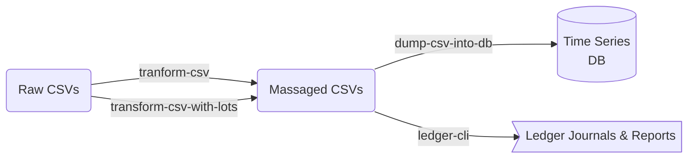

# AggreGator

A financial health dashboard.

## Automatic [PTA](https://plaintextaccounting.org/)

The goal of this project is to have some automated process that:

1. downloads transaction data from banks
1. imports them into Ledger
1. generates neat charts to my specification

Downloading transactions is in another repo...

## Usage

Put a _.env_ in the project root and define these variables:

- `TXN_PATH`: path to transactions directory (your data that you need to play with)
  - It's optional if you define a volume named txn where you'll have your transactions. `docker volume create txn`... But why, though?

> TODO: Add the rest of the variables: db and grafana stuff

```shell
docker compose up
# now you can login to the aggregator container:
docker exec -it aggregator /bin/bash
```

> TODO: Talk about the cli when it's done

You probably don't want to spin down everything. If you `docker compose down`, the non-external volumes (everything but your optional txn volume) will be gone...
So the db will need to be hydrated again and the dashboard will need re-building.
You can just `docker compose stop` to stop the containers and `docker compose start` when you need them again.

> TODO: Talk about the data directory structure

## Contributing

This project currently uses `poetry`. You **probably** want to use the included _.devcontainer/_.
Install the dependencies with `poetry install`. Now you can run the _(WIP)_ AggreGator CLI with:

```shell
poetry run aggregator
```

To test, lint, etc., run `make help` for a list of targets. You can figure it out from there.

## Overview

I'm taking some inspiration from the following resources:

- [Full-fledged Hledger](https://github.com/adept/full-fledged-hledger/wiki)
- [Visualise your finances with hledger, InfluxDB, and Grafana](https://memo.barrucadu.co.uk/hledger-influxdb-grafana.html)
- [Personal Finance](https://memo.barrucadu.co.uk/personal-finance.html)
- [Getting Started with Ledger](https://rolfschr.github.io/gswl-book/latest.html)

I'm not too familiar with Haskell, but building "Hello World" took 10 minutes and that's far from reasonable.
I will be using python to scrub the data and Ledger directly.

The project looks like this:



## Concepts

I think it's worth pointing out some accounting ideas that I'll be using.

- For stocks and crypto, I need to know which lot I'm selling. For now, I'll assume FIFO.
- I'll track credit as contra assets instead of liabilities.
- To mitigate duplicates, I'm transforming `asset <-> asset` tranfers into `asset <-> Equity:Tranfer` transfers.
- Similarly, stock purchases need to go through a conversion. `$ -> ticker` becomes `$ -> Equity:Conversion $ -> Equity:Conversion ticker -> ticker`.

### Accounts

```txt
Assets:
  Checking:last4
  Savings:last4
  Credit:last4
  Stocks:Ticker:LotDate:CostBasis
  Crypto:Ticker:LotDate:CostBasis
  401K:...
  IRA:...
  RothIRA:...

Liabilities:
  loan:last4
  mortgage:...
  auto:...
  student:...

Expenses:
  Groceries:Store:IndividualItems??
  Transportation:Vendor
  P2P:Person
  Category:Shop
  CapitalLoss:Long
  CapitalLoss:Short

Revenue/Income:
  Salary:Employer
  Sale:...
  CapitalGain:Long
  CapitalGain:Short
  P2P:Person
Equity:
  Opening Balance
  Closing Balance
  Conversion (?)
  Transfer (?)

(?) maybe should be assets
```

### Useful expense categories

- Home
- Appliance (wut?)
- Clothing
- Personal
- Fees
- Bills (phone, electric, gas)
- Rent (not a bill??)
- Groceries
- Dining
- Tithing/Giving
- Transportation
- Taxes
- P2P
- Electronics
- Entertainment
- Business
- Shopping
